# 💾 SQL Data Management Project 🚀

Welcome to my **SQL Practice Project** 🎯
This project demonstrates **CRUD operations**, **filtering**, **aggregation**, and **data analysis** using multiple tables.

📌 Tables Covered:

* 👤 Customers
* 🛒 Orders
* 📦 Products
* 📊 Order Details

---

# 🧾 📌 1. CUSTOMERS TABLE

This table stores customer information like **name, email, and address**.

## 🧠 Operations Performed:

* Insert Data → Add multiple customers
* Update Address → Modify existing record
* Delete Record → Remove unwanted data
* Filter by Name → Search specific customers

---

## 📸 Screenshots

### 🔹 Initial Data

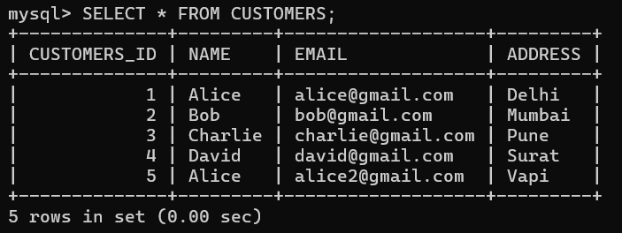

### 🔹 Update Address

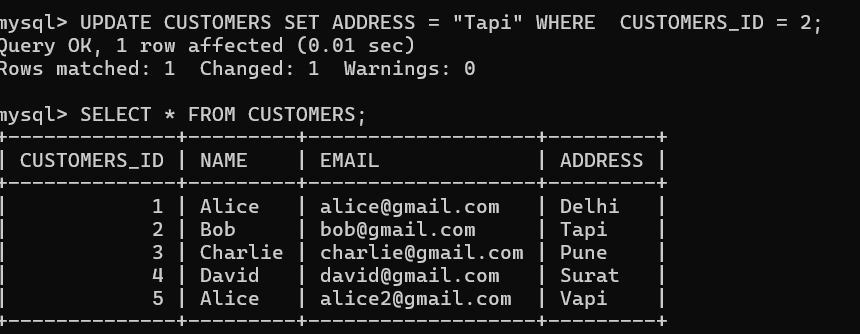

### 🔹 Delete Record

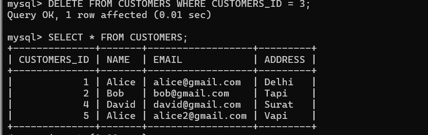

### 🔹 Filter by Name (Alice)

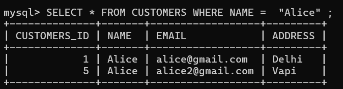

---

# 🛒 📌 2. ORDERS TABLE

This table contains order details like **order date and total amount**.

## 🧠 Operations Performed:

* Select Orders → Fetch specific customer orders
* Update Amount → Modify order value
* Delete Order → Remove order record
* Aggregate Functions → Analyze data (MAX, MIN, AVG)

---

## 📸 Screenshots

### 🔹 Select Orders

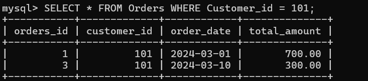

### 🔹 Update Order Amount

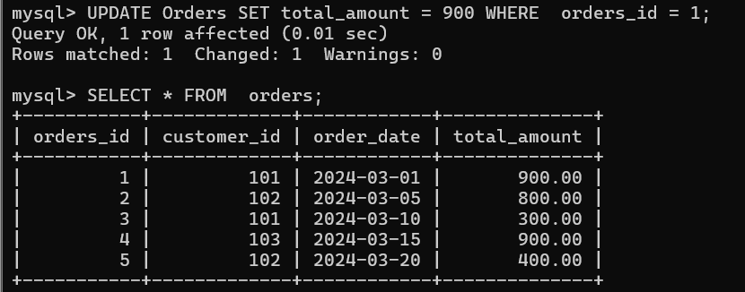

### 🔹 Delete Order

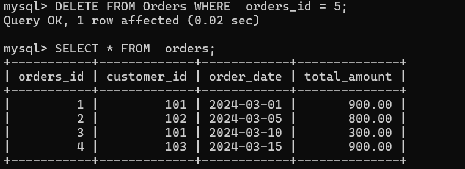

### 🔹 Final Table Output

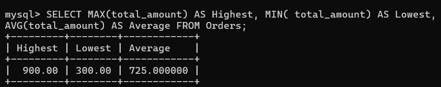

---

# 📦 📌 3. PRODUCTS TABLE

This table stores product information like **price and stock availability**.

## 🧠 Operations Performed:

* Sort by Price → Show highest to lowest price
* Filter by Price Range → Find products in range
* Find Highest & Lowest Price → Data analysis

---

## 📸 Screenshots

### 🔹 Sorted Products (DESC)

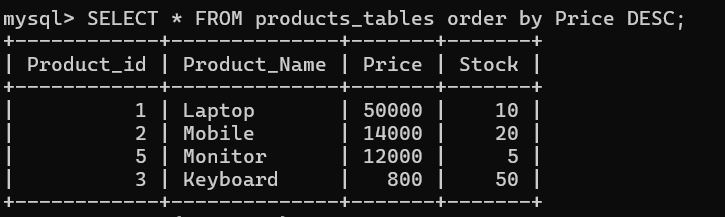

### 🔹 Price Range Filter

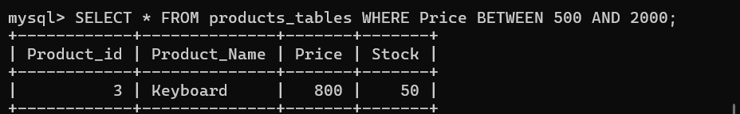

### 🔹 Highest & Lowest Price

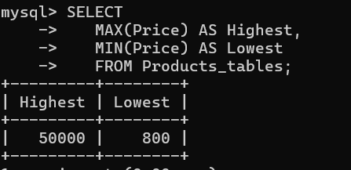

---

# 📊 📌 4. ORDER DETAILS TABLE

This table tracks **product-wise order details, sales, and revenue analysis**.

## 🧠 Operations Performed:

* Fetch Order Details → View items in a specific order
* Calculate Total Revenue → Sum of all sales
* Top 3 Products → Most sold items
* Count Product Sales → Number of times each product sold

---

## 📸 Screenshots

### 🔹 Order Details

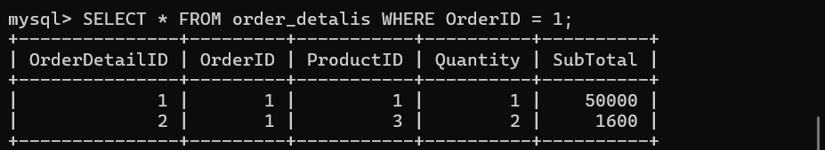

### 🔹 Total Revenue

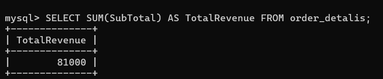

### 🔹 Top Products

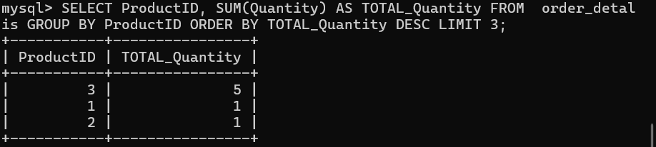

---
📸 Screenshot:
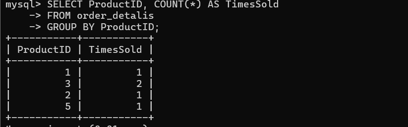


👉 This query shows how many times each product is sold:

```sql
SELECT ProductID, COUNT(*) AS TimesSold
FROM order_detalis
GROUP BY ProductID;
```

📸 Screenshot:


# ⚙️ 🛠️ Technologies Used

* 💻 MySQL
* 🧾 SQL Queries
* 📊 Data Analysis Functions

---

# 🚀 Key Concepts Learned

✅ CRUD Operations (Create, Read, Update, Delete)
✅ Filtering Data (WHERE, BETWEEN)
✅ Sorting (ORDER BY)
✅ Aggregation (SUM, AVG, MAX, MIN)
✅ Grouping Data (GROUP BY, COUNT)

---

# 📂 SQL Script

👉 Full SQL Code Available Here:


---
# 🌟 Final Note

This project is perfect for:

* 📚 Exams
* 🎤 Viva
* 💻 Practice


# 👨‍💻 Author

**Dhruv Prajapati** ✨

---

🚀 Keep learning SQL and build more projects!
